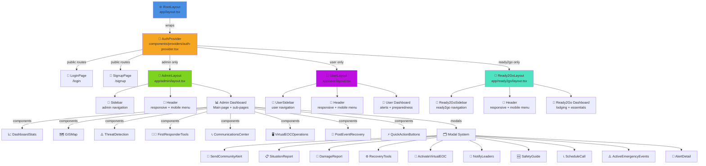
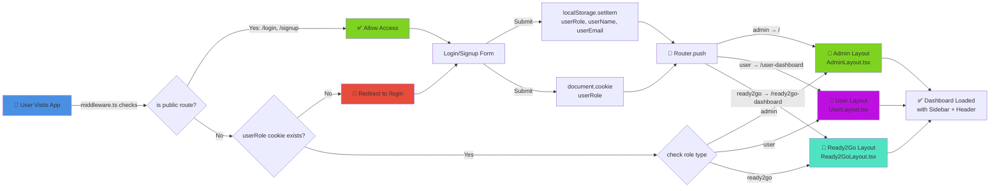
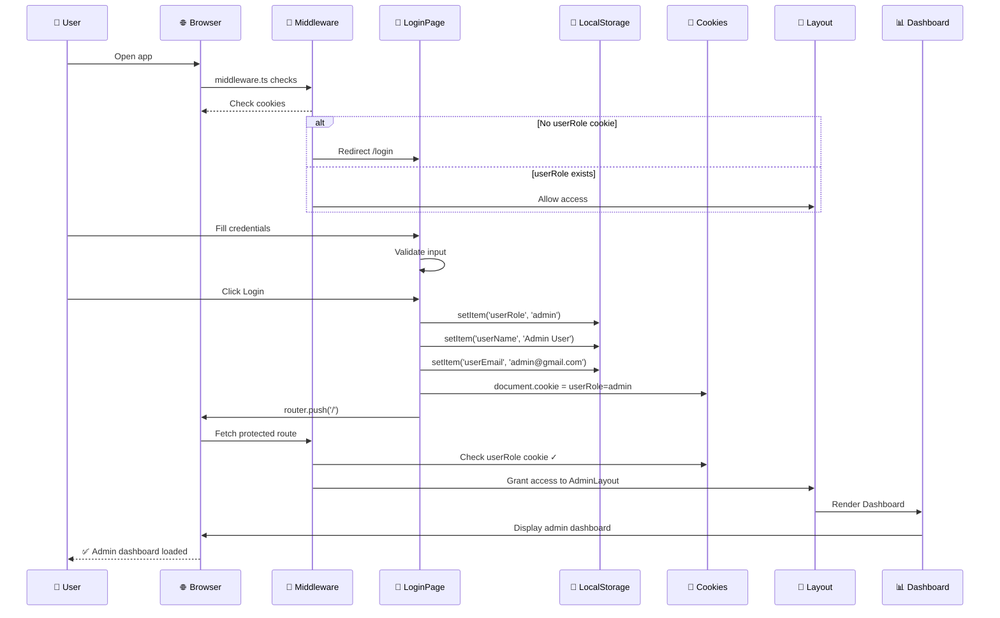
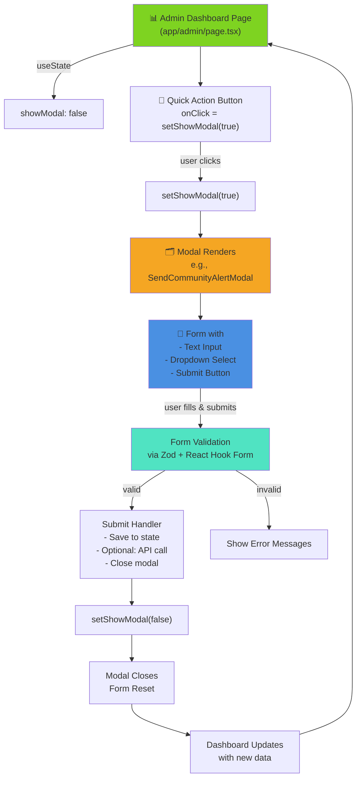

# Ready2Go Emergency Dashboard - Visual Architecture Diagrams

## 1. Application Structure (Component Tree)



---

## 2. Authentication & Authorization Flow



---

## 3. Responsive Design Breakpoints

```
┌─────────────────────────────────────────────────────────────────────┐
│                    RESPONSIVE DESIGN STRATEGY                        │
└─────────────────────────────────────────────────────────────────────┘

MOBILE              TABLET              DESKTOP             LARGE
(320-639px)         (640-1023px)        (1024-1535px)       (1536px+)

Header:
┌─────────────┐    ┌──────────────┐    ┌────────────────────┐
│ ☰ search 👤 │    │ ☰ search 👤  │    │ search........ 👤  │
│ alert notify │    │ alert notify │    │ alert notify 👤    │
└─────────────┘    └──────────────┘    └────────────────────┘

Sidebar:
   Drawer         Fixed if open        Fixed (always visible)
┌───────────┐    ┌────────────┐       ┌──────────────┐
│ [drawer]  │    │ Admin Nav  │       │  Admin Nav   │
│ • Menu    │    │ • Menu     │       │  • Menu      │
│ • Links   │    │ • Links    │       │  • Links     │
└───────────┘    └────────────┘       └──────────────┘

Content Grid:
1 column        2 columns           3-4 columns
┌──────────┐    ┌───────┬────────┐   ┌────┬────┬────┐
│  Card 1  │    │ Card1 │ Card2  │   │ C1 │ C2 │ C3 │
├──────────┤    ├───────┼────────┤   ├────┼────┼────┤
│  Card 2  │    │ Card3 │ Card4  │   │ C4 │ C5 │ C6 │
├──────────┤    └───────┴────────┘   └────┴────┴────┘
│  Card 3  │
└──────────┘

Tailwind Breakpoints:
sm   (640px)  - small phones
md   (768px)  - tablets → header reduces search, sidebar collapsible
lg   (1024px) - desktop → full layout
xl   (1280px) - large desktop → optimized spacing
2xl  (1536px) - extra large → max-width containers

Key Classes:
├─ hidden md:block          (hide on mobile, show on tablet+)
├─ md:flex                  (flex layout on tablet+)
├─ grid-cols-1 md:grid-cols-2 lg:grid-cols-4
├─ px-4 md:px-6            (padding responsive)
├─ text-sm md:text-base lg:text-lg (typography scaling)
└─ absolute md:relative     (position changes at breakpoints)
```

---

## 4. Sidebar Navigation Maps

```
ADMIN SIDEBAR (9 items)
━━━━━━━━━━━━━━━━━━━━━━━━━━━━
📊 Dashboard         → /
⚠️  Emergency Events  → /emergency-events
🔔 Alerts & Comms    → /alerts-communication
🗺️  GIS & Mapping     → /gis-mapping
👥 Responders        → /responders-agencies
🧠 Virtual EOC AI    → /virtual-eoc-ai-center
📋 After Action Rev. → /after-action-review
📄 Emergency Plan    → /emergency-plan
ℹ️  Preparedness      → /preparedness-information
━━━━━━━━━━━━━━━━━━━━━━━━━━━━
⚙️  Settings          → /virtual-eoc-settings
❓ Help              → modal
━━━━━━━━━━━━━━━━━━━━━━━━━━━━

USER SIDEBAR (7 items)
━━━━━━━━━━━━━━━━━━━━━━━━━━━━
📊 Dashboard         → /user-dashboard
🔔 Alerts            → /user/alerts
📍 My Locations      → /user/my-locations
📄 Emergency Plan    → /user/emergency-plan
🛡️  Preparedness      → /user/preparedness
☁️  Weather           → /user/weather
📰 News & Updates    → /user/news-updates
━━━━━━━━━━━━━━━━━━━━━━━━━━━━

READY2GO SIDEBAR (5 items)
━━━━━━━━━━━━━━━━━━━━━━━━━━━━
📊 Dashboard         → /ready2go-dashboard
🏨 Lodging & Essent. → /ready2go/lodging-essentials
🚨 Emergency Center  → /ready2go/emergency-center
🔧 Maintenance       → /ready2go/emergency-maintenance
☁️  Weather & Traffic → /ready2go/weather-traffic
━━━━━━━━━━━━━━━━━━━━━━━━━━━━
⚙️  Settings          → modal
❓ Help              → modal
━━━━━━━━━━━━━━━━━━━━━━━━━━━━
```

---

## 5. Data Flow: Login to Dashboard



---

## 6. Component Interaction: Modal Pattern



---

## 7. File Structure Tree (Abbreviated)

```
emergency-dashboard-clone1/
├── app/
│   ├── layout.tsx                    ← Root layout
│   ├── globals.css                   ← Global styles
│   ├── login/
│   ├── signup/
│   ├── (admin)/
│   │   ├── layout.tsx               ← Admin layout with Sidebar
│   │   ├── page.tsx                 ← Main admin dashboard
│   │   ├── emergency-events/
│   │   ├── alerts-communication/
│   │   ├── gis-mapping/
│   │   ├── responders-agencies/
│   │   ├── virtual-eoc-ai-center/
│   │   ├── after-action-review/
│   │   ├── emergency-plan/
│   │   ├── preparedness-information/
│   │   ├── virtual-eoc-settings/
│   │   └── eoc-mode-dashboard/
│   ├── (user)/
│   │   ├── layout.tsx               ← User layout with UserSidebar
│   │   ├── user-dashboard/
│   │   └── user/
│   │       ├── alerts/
│   │       ├── my-locations/
│   │       ├── emergency-plan/
│   │       ├── preparedness/
│   │       ├── weather/
│   │       └── news-updates/
│   └── (ready2go)/
│       ├── layout.tsx               ← Ready2Go layout
│       ├── ready2go-dashboard/
│       └── ready2go/
│           ├── lodging-essentials/
│           ├── emergency-center/
│           ├── emergency-maintenance/
│           └── weather-traffic/
├── components/
│   ├── header.tsx                   ← Responsive header with mobile menu
│   ├── sidebar.tsx                  ← Admin sidebar
│   ├── user-sidebar.tsx             ← User sidebar
│   ├── ready2go-sidebar.tsx         ← Ready2Go sidebar
│   ├── providers/
│   │   └── auth-provider.tsx        ← Auth context & protection
│   ├── modals/
│   │   ├── send-community-alert-modal.tsx
│   │   ├── situation-report-modal.tsx
│   │   ├── damage-report-modal.tsx
│   │   ├── recovery-tools-modal.tsx
│   │   ├── activate-virtual-eoc-modal.tsx
│   │   ├── notify-leaders-modal.tsx
│   │   ├── safety-guide-modal.tsx
│   │   ├── schedule-call-modal.tsx
│   │   ├── active-emergency-events-modal.tsx
│   │   └── alert-detail-modal.tsx
│   ├── ui/                          ← Radix UI wrapped components
│   │   ├── button.tsx
│   │   ├── card.tsx
│   │   ├── dialog.tsx
│   │   ├── drawer.tsx
│   │   ├── input.tsx
│   │   ├── select.tsx
│   │   ├── switch.tsx
│   │   └── [... 30+ more UI components]
│   ├── dashboard-stats.tsx
│   ├── gis-map.tsx
│   ├── threat-detection.tsx
│   ├── first-responder-tools.tsx
│   ├── communications-center.tsx
│   ├── virtual-eoc-operations.tsx
│   ├── post-event-recovery.tsx
│   ├── quick-action-buttons.tsx
│   ├── GuidanceProtocolSheet.tsx
│   ├── theme-provider.tsx
│   └── AlertDetailModal.tsx
├── hooks/
│   ├── use-mobile.ts               ← Mobile breakpoint detection
│   └── use-toast.ts                ← Toast notifications
├── lib/
│   └── utils.ts                     ← cn() utility, helpers
├── public/
│   ├── logo.png
│   ├── icon.svg
│   ├── icon-light-32x32.png
│   ├── icon-dark-32x32.png
│   └── apple-icon.png
├── middleware.ts                    ← Route protection
├── next.config.mjs
├── tsconfig.json
├── package.json
├── pnpm-lock.yaml
├── postcss.config.mjs
├── components.json                  ← shadcn/ui config
└── PROJECT_ARCHITECTURE.md          ← This doc!
```

---

## 8. Role-Based Access Control Matrix

```
┌──────────────────────────────────────────────────────────────────────┐
│                    ROLE-BASED ACCESS CONTROL (RBAC)                  │
├──────────────────────┬──────────────┬──────────────┬─────────────────┤
│     Feature/Route    │    Admin     │     User     │    Ready2Go     │
├──────────────────────┼──────────────┼──────────────┼─────────────────┤
│ /                    │      ✅      │      ❌      │        ❌       │
│ /dashboard           │      ✅      │      ❌      │        ❌       │
│ /user-dashboard      │      ❌      │      ✅      │        ❌       │
│ /ready2go-dashboard  │      ❌      │      ❌      │        ✅       │
│ /emergency-events    │      ✅      │      ❌      │        ❌       │
│ /alerts-communication│      ✅      │      ❌      │        ❌       │
│ /gis-mapping         │      ✅      │      ❌      │        ❌       │
│ /responders-agencies │      ✅      │      ❌      │        ❌       │
│ /virtual-eoc-ai-center│     ✅      │      ❌      │        ❌       │
│ /eoc-mode-dashboard  │      ✅      │      ❌      │        ❌       │
│ /emergency-plan      │      ✅      │   View Only  │        ❌       │
│ /preparedness-info   │      ✅      │   View Only  │        ❌       │
│ /ready2go/*          │      ❌      │      ❌      │        ✅       │
│ /user/*              │      ❌      │      ✅      │        ❌       │
├──────────────────────┴──────────────┴──────────────┴─────────────────┤
│ Protected by: middleware.ts (cookie check) + AuthProvider (route)    │
└─────────────────────────────────────────────────────────────────────┘
```

---

## 9. State Management Overview

```
LOCAL STATE
═══════════════════════════════════════════════════════════════

Component Level (useState):
├─ Modal visibility: showModal, showDetails, showForm
├─ Form data: formData, errors, loading
├─ User input: email, password, searchTerm
├─ Toggle states: isOpen, isExpanded, isSelected
└─ Pagination: currentPage, itemsPerPage

Layout Level (useState):
├─ userName, userEmail (from localStorage)
├─ isLoading (auth check)
└─ sidebarOpen (mobile drawer state)


PERSISTENT STATE
═══════════════════════════════════════════════════════════════

LocalStorage:
├─ userRole: 'admin' | 'user' | 'ready2go'
├─ userName: string
└─ userEmail: string

Cookies:
└─ userRole: (used by middleware for server-side checks)


CONTEXT / PROVIDERS
═══════════════════════════════════════════════════════════════

AuthProvider (components/providers/auth-provider.tsx):
├─ Wraps entire app
├─ Checks userRole on every route
├─ Redirects unauthorized users
└─ Manages route protection


FUTURE SCALABILITY
═══════════════════════════════════════════════════════════════

Current: localStorage + cookies (simple, client-side)
Plan: 
├─ API Backend
│  ├─ JWT tokens instead of cookies
│  ├─ Backend session management
│  └─ Database for persistent data
├─ State Management
│  ├─ Context API for global state
│  ├─ Redux or Zustand for complex states
│  └─ React Query / SWR for server state
└─ Real-time
   ├─ WebSocket for live updates
   ├─ Server-Sent Events (SSE)
   └─ Push notifications
```

---

## 10. Component Library (Radix UI + Tailwind)

```
UI COMPONENTS AVAILABLE
═══════════════════════════════════════════════════════════════

Input & Form:
├─ Input         → text, password, email fields
├─ Select        → dropdown menus
├─ Checkbox      → toggle checkboxes
├─ Radio Group   → radio buttons
├─ Switch        → toggle switches
├─ Textarea      → multi-line text
└─ Form          → React Hook Form integration

Display:
├─ Card          → container/card component
├─ Badge         → labels/tags
├─ Alert         → notifications
├─ Progress      → progress bars
├─ Skeleton      → loading placeholders
├─ Avatar        → user profile images
├─ Breadcrumb    → navigation hierarchy
└─ Empty         → empty state

Interaction:
├─ Button        → actions (primary, secondary, danger)
├─ Dialog        → modal windows
├─ Drawer        → side sheets
├─ Popover       → floating popups
├─ Tooltip       → hover tooltips
├─ Dropdown Menu → dropdown actions
├─ Context Menu  → right-click menus
└─ Accordion     → collapsible sections

Navigation:
├─ Tabs          → tab navigation
├─ Menubar       → top menu bar
├─ Navigation Menu → hierarchical navigation
└─ Pagination    → page navigation

Charts & Data:
├─ Chart         → custom chart container
└─ (Recharts for actual visualizations)

Utilities:
├─ Separator     → visual divider
├─ Scroll Area   → scrollable container
├─ Resizable     → resizable panels
├─ Carousel      → image carousel
└─ Command       → command palette
```

---

## 11. Responsive Mobile Menu Implementation

```
MOBILE MENU INTERACTION FLOW
═══════════════════════════════════════════════════════════════

Header Component (components/header.tsx):
┌─────────────────────────────────┐
│ [☰] [🔍] [🔔] [👤 UserMenu]   │ ← Mobile: hamburger + search icon
│ search............. [🔔] [👤]  │ ← Desktop: full search bar
└─────────────────────────────────┘

onClick [☰]:
  └─ setShowSidebar(true)
     └─ Render Mobile Drawer
        ├─ Overlay: bg-black/50 onClick closes drawer
        ├─ Sidebar: w-72 bg-sidebar
        │  ├─ Close button [X]
        │  ├─ Logo/branding
        │  └─ Navigation Links (using exported menuItems)
        └─ onClick link closes drawer

onClick [🔍]:
  └─ setShowSearch(!showSearch)
     └─ Toggle Search Input
        ├─ Appears below header
        └─ Compact search bar (md:hidden)

Desktop (md: breakpoint):
  ├─ Hamburger hidden (md:hidden)
  ├─ Search icon hidden (md:hidden)
  ├─ Full search bar visible (hidden md:block)
  └─ Sidebar always visible (fixed left)
```

---

## Quick Navigation Cheat Sheet

| User Type | Login Email | Password | Landing | Main Pages |
|-----------|------------|----------|---------|-----------|
| **Admin** | admin@gmail.com | admin123 | / | Dashboard, Events, Alerts, GIS, Responders, EOC AI, Settings |
| **Regular User** | test@yopmail.com | test123 | /user-dashboard | Dashboard, Alerts, Locations, Plans, Weather |
| **Ready2Go User** | test1@yopmail.com | test123 | /ready2go-dashboard | Lodging, Emergency Center, Maintenance, Weather |

---

**Last Updated:** February 5, 2026  
**Project:** Ready2Go Emergency Operations Dashboard  
**Stack:** Next.js 16 + React 19 + TypeScript + Tailwind CSS 4  
**Status:** ✅ Core UI Complete | 🚀 Responsive Updates In Progress
